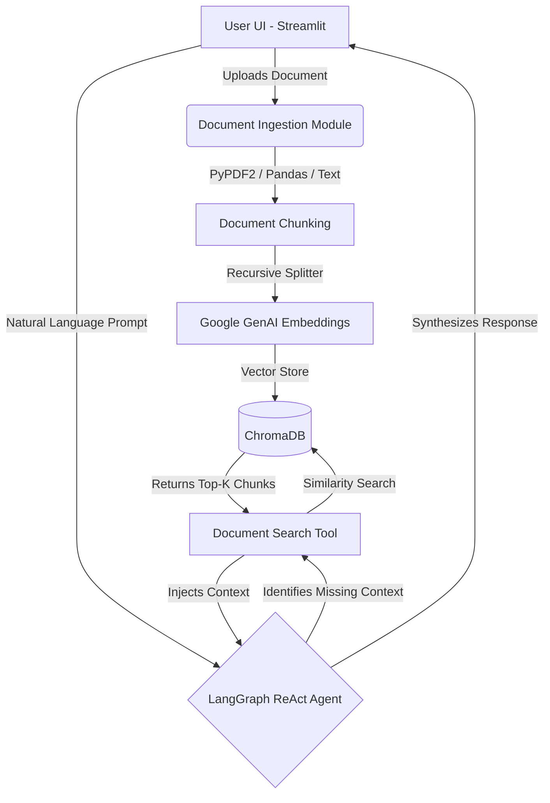

# Agentic RAG Knowledge System: Project Documentation

This document outlines the architecture, setup, and deployment process for the Generative AI-powered application that enables users to query enterprise documents using autonomous AI agents.

## 1. System Setup & Deployment

### Prerequisites
- Python 3.10+
- An active Google Gemini API Key
- `pip` environment manager (or `conda` for macOS/Linux environments)

### Setup Instructions
1. **Clone the repository**:
   ```bash
   git clone https://github.com/kassemfor/capstone-project-tts.git
   cd capstone-project-tts
   ```

2. **Establish Environment Variables**:
   Create a `.env` file at the root of the project.
   ```env
   GEMINI_API_KEY=your_gemini_api_key_here
   ```

3. **Install Dependencies**:
   ```bash
   pip install -r requirements.txt
   ```
   *Note: If encountering externally-managed-environment errors on macOS, ensure you're acting inside a safe virtual environment (`python -m venv venv && source venv/bin/activate`).*

4. **Launch the Application**:
   ```bash
   streamlit run app.py
   ```
   Navigate to the **Agentic RAG** page on the sidebar to begin interacting with the document query system.

---

## 2. Architecture Overview

The system is designed as a modular Streamlit multipage application. It integrates two primary Generative AI pipelines: A standard translation TTS pipeline, and the newly integrated Agentic Retrieval-Augmented Generation (RAG) pipeline.

### System Architecture Diagram



### Core Components
- **Frontend Layer**: Built using `Streamlit`. The UI provides an intuitive drag-and-drop file interface, native chat tracking (`st.chat_message`), and dynamic session state management.
- **Ingestion & Data Normalization Engine**: Housed within `agent_logic.py`. Uploaded payloads (PDFs via `PyPDF2`, CSV/Excel via `pandas`, or plain text) are decoded, structured into plain-text strings, and packaged into LangChain `Document` objects.
- **Embedding & Vector Knowledge Store**: Text strings are chunked using `RecursiveCharacterTextSplitter` into overlapping 1000-character segments. These chunks are embedded using Google's `gemini-embedding-001` and placed into an in-memory `ChromaDB` vector database.
- **Agent Orchestration**: Handled by `LangGraph`. We initialize an autonomous LangChain Tool-calling ReAct agent (`gemini-2.5-flash`) that retains conversational history and invokes retrieval tools iteratively to arrive at factual answers.

---

## 3. Agent Roles

The application utilizes one primary **Autonomous Reasoning Agent** created via LangGraph's `create_react_agent` architecture.

### Reasoning Responsibilities
- **Context Routing**: The agent decides if the user's prompt requires external operational knowledge (e.g., retrieving data from the uploaded PDFs) or if it can be answered using general conversational context already in the chat state.
- **Tool Calling**: The agent dynamically supplies search queries to the `document_search_tool` (a LangChain Retriever wrapping the Chroma VectorStore) when it identifies missing context.
- **Synthesis**: The agent grounds the retrieved vector chunks back into natural language, parsing the most relevant bits into a clean, synthesized answer for the user.

---

## 4. Limitations

1. **Memory Volatility**: The `ChromaDB` instance is currently injected into Streamlit's `st.session_state`. This means that if the browser page is refreshed, the user loses their vector embeddings and must re-process the documents.
2. **Document Size Scale**: Because ingestion relies on local memory and Streamlit file upload chunking, vast enterprise documents (e.g., PDFs > 50MB or Excel files with millions of rows) might exhaust local RAM constraints or stream limits before reaching the `ChromaDB` indexing phase.
3. **Chunking Fidelity**: We rely on standard `RecursiveCharacterTextSplitter`. While capable, heavily formatted documents (complex tables, nested lists, dual-column layouts) may lose specific formatting context when linearly chunked.

---

## 5. Challenges Faced During Development

1. **Dependency Drift and Package Structures**:
   - *Challenge*: The Langchain ecosystem shifts rapidly. Initial implementations aiming to use `AgentExecutor` were met with depreciation errors `ModuleNotFoundError: No module named 'langchain.tools.retriever'`, demanding immediate pivot and migration to `LangGraph` state modifications to wrap the conversational agent functionality securely.
   - *Challenge*: Discrepancies between historical Gemini API endpoints (`models/embedding-001` vs `text-embedding-004` vs `gemini-embedding-001`) resulted in 404 API Not Found issues when injecting document arrays into ChromaDB. We navigated this via direct client listing calls to map authorized models on the target API key.

2. **Cross-Platform Environment Management**:
   - We experienced issues installing standard requirements via `pip` due to recent macOS safeguards involving `externally-managed-environments`. Safe sandboxing strategies were necessary using scoped virtual environments.

3. **Multi-turn History Formats**:
   - Modern Agent tooling via `LangGraph` expects robust schema patterns (`messages` dictionaries). Moving standard Streamlit message tracking logic to seamlessly mesh with LangGraph's dynamic injection parameters required strict remapping iterations.

---

*This document is also mirrored in the repository under `Documentation Walkthrough.md`.*
