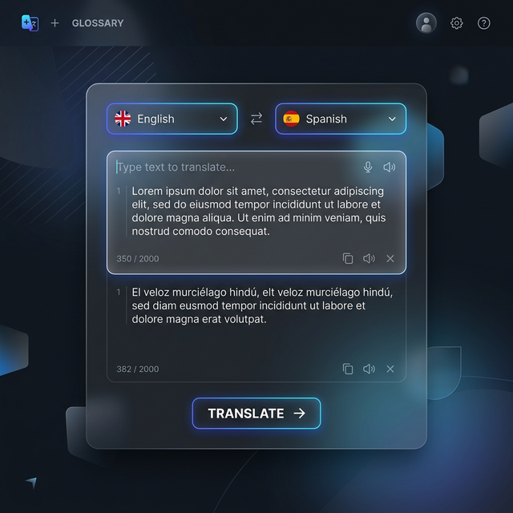

# 🌐 Translate & Speak: AI-Powered Language Orchestrator


## 🚀 Overview
**Translate & Speak** is a high-performance Streamlit application that bridges communication gaps by combining state-of-the-art LLM translation with advanced Text-to-Speech (TTS) capabilities. Whether you're entering text manually or uploading complex documents, this tool provides seamless translation and instant audio playback.



## ✨ Key Features
- **Multi-Source Input**: Supports manual text entry and file uploads (`.txt`, `.pdf`, `.csv`, `.xlsx`).
- **LLM-Powered Translation**: Leverages **Google Gemini 2.5 Flash** for high-accuracy translations.
- **Local Model Support**: Integrates with **Ollama** and **Llama.cpp** for private, offline translations.
- **Natural Speech Synthesis**: Uses **gTTS (Google Text-to-Speech)** to generate clear audio in the target language.
- **Instant Download**: One-click MP3 download for all generated audio.
- **Premium UI**: Sleek, dark-mode interface designed for a professional user experience.

## 🛠️ Tech Stack
- **Frontend**: [Streamlit](https://streamlit.io/)
- **Translation Engine**: [Google Generative AI](https://ai.google.dev/) (Gemini), [Ollama](https://ollama.com/), [Llama.cpp](https://github.com/ggerganov/llama.cpp)
- **Audio Engine**: [gTTS](https://pypi.org/project/gTTS/)
- **Data Processing**: [Pandas](https://pandas.pydata.org/), [PyPDF2](https://pypdf2.readthedocs.io/)

## ⚙️ Installation & Setup

1. **Clone the Repository**
   ```bash
   git clone https://github.com/kassemfor/capstone-project-tts.git
   cd capstone-project-tts
   ```

2. **Set up Virtual Environment**
   ```bash
   python -m venv venv
   source venv/bin/activate  # On Windows: venv\Scripts\activate
   ```

3. **Install Dependencies**
   ```bash
   pip install -r requirements.txt
   ```

4. **Environment Configuration**
   Create a `.env` file in the root directory and add your Gemini API Key:
   ```env
   GEMINI_API_KEY=your_api_key_here
   ```

5. **Run the Application**
   ```bash
   streamlit run app.py
   ```

## 📖 Usage
1. **Choose Input Method**: Select between "Enter Text" or "Upload File".
2. **Select LLM Provider**: Choose "Google Gemini" or a local provider.
3. **Select Target Language**: Choose from dozens of supported languages.
4. **Translate & Generate**: Hit the button to see the translation and listen to the audio!

---
*Created by [Kassem](https://github.com/kassemfor) as a Capstone Project.*
