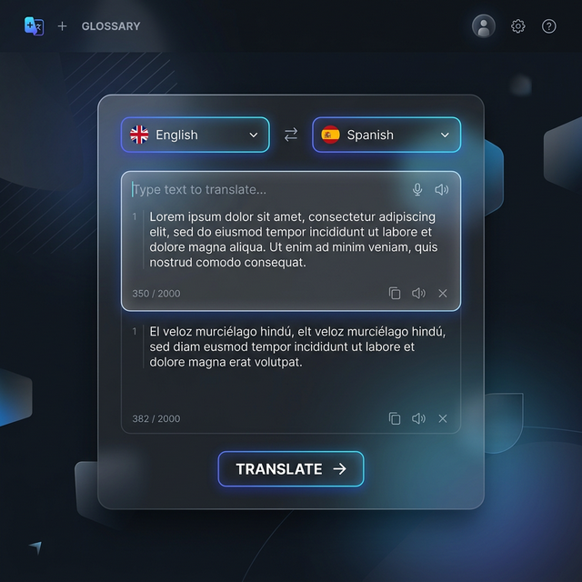

# 🌐 Translate & Speak: AI-Powered Language Orchestrator


## 🚀 Overview
**Translate & Speak** is a high-performance Streamlit application that bridges communication gaps by combining state-of-the-art LLM translation with advanced Text-to-Speech (TTS) capabilities. Whether you're entering text manually or uploading complex documents, this tool provides seamless translation and instant audio playback.



## ✨ Key Features
- **Multi-Source Input**: Supports manual text entry and file uploads (`.txt`, `.pdf`, `.csv`, `.xlsx`).
- **LLM-Powered Translation**: Leverages **Google Gemini 2.5 Flash** for high-accuracy translations.
- **Agentic RAG Knowledge Base**: Upload enterprise documents and use the integrated LangChain AI Agent to query, reason, and answer questions logically using RAG and Vector Databases.
- **Local Model Support**: Integrates with **Ollama** and **Llama.cpp** for private, offline translations.
- **Natural Speech Synthesis**: Uses **gTTS (Google Text-to-Speech)** to generate clear audio in the target language.
- **Instant Download**: One-click MP3 download for all generated audio.
- **Premium UI**: Sleek, dark-mode interface designed for a professional user experience.

## 🛠️ Tech Stack
- **Frontend**: [Streamlit](https://streamlit.io/)
- **GenAI / Translation Engine**: [Google Generative AI](https://ai.google.dev/) (Gemini), [LangChain](https://langchain.com/)
- **Vector Store**: [ChromaDB](https://www.trychroma.com/)
- **Audio Engine**: [gTTS](https://pypi.org/project/gTTS/)
- **Data Processing**: [Pandas](https://pandas.pydata.org/), [PyPDF2](https://pypdf2.readthedocs.io/)

## ⚙️ Installation & Setup

1. **Clone the Repository**
   ```bash
   git clone https://github.com/kassemfor/capstone-project-tts.git
   cd capstone-project-tts
   ```

2. **Set up Virtual Environment**
   ```bash
   python -m venv venv
   source venv/bin/activate  # On Windows: venv\Scripts\activate
   ```

3. **Install Dependencies**
   ```bash
   pip install -r requirements.txt
   ```

4. **Environment Configuration**
   Create a `.env` file in the root directory and add your Gemini API Key:
   ```env
   GEMINI_API_KEY=your_api_key_here
   ```

5. **Run the Application**
   ```bash
   streamlit run app.py
   ```

## 📖 Usage
1. **Choose Input Method**: Select between "Enter Text" or "Upload File" in the Translation interface.
2. **Translate & Generate**: Translate the content and generate Text-to-Speech outputs.
3. **Agentic RAG**: Switch to the **Agentic RAG** page on the sidebar. Upload any configuration documents or PDFs, process them, and chat with a LangChain reasoning agent.

## 🧠 Architectural Overview & Limitations
The application consists of two core workflows:
1. **Translation Workflow**: Processes raw text or extracted files and pushes them directly through an LLM sequence.
2. **Agentic RAG Workflow**:
   - **Document Processing**: Uploaded documents are converted to text and chunked utilizing `RecursiveCharacterTextSplitter`.
   - **Vector Embedding**: Each chunk is embedded using `GoogleGenerativeAIEmbeddings` and stored in a lightweight SQLite-based ChromaDB instance.
   - **Agent Loop**: A LangChain tool-calling agent uses a `document_search_tool` to reason over the user's query and extract only factual context.
   - **Safety Controls**: The system prompt is engineered to reject hallucinations; if the context does not appear in the embedded documents, the agent will gracefully decline to answer.

*Limitations*: The current vector database runs in memory during a single Streamlit session state and will reset on page reload. Huge documents (>50MB) may timeout Streamlit's file ingest handler without additional caching structures.

---
*Created by [Kassem](https://github.com/kassemfor) as a Capstone Project.*
